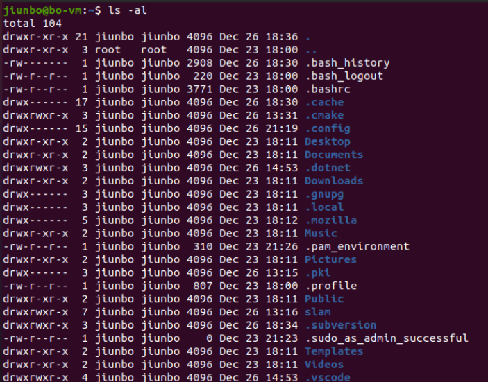

[TOC]

# 研0入门

## 了解研究领域概况

1. 了解研究领域的背景
2. 由背景入手建立研究领域的框架
3. 

### 寻找适合的文献

1. 找准关键术语，用不同的数据库检索文献 

***

## SLAM十四讲学习

### 学习这本书的方法

1. **理解算法**，补习数学基础
2. **应用实践**，跟着书敲代码，调调参数
3. **习题**，建议都练习一遍，对掌握知识很有帮助

### SLAM的数学描述

$$
\begin{cases}
	x_{k+1} = f(x_k,u_k)+w_k &\text{运动}\\
	z_{k,j} = h(x_k,y_j)+v_{k,j} &\text{观测}\\
\end{cases}
$$

已知$(u_k,z_{k,j})\to(x_k\text{定位},y_j\text{建图})$，相当于一个状态估计问题

### 第3讲 三维空间刚体运动

**坐标系间的欧式变换**

使用一个旋转矩阵**R**和一个平移向量**t**完整地描述了一个欧氏空间的坐标变换
$$
a^`=Ra+t
$$
但上述描述经过多次变换会显得很罗嗦并存在非线性关系，因此，引入**齐次坐标**和**变换矩阵**
$$
\begin{bmatrix}
a^`\\
1
\end{bmatrix}
=
\begin{bmatrix}
R & t\\
0^T & 1
\end{bmatrix}
\begin{bmatrix}
a\\1
\end{bmatrix}
\overset{\text{def}}{=}
T
\begin{bmatrix}
a\\1
\end{bmatrix}
$$
这样使得整个变系为线性关系，其中矩阵**T**称为**变换矩阵**

<u>关于四元数旋转，矩阵的迹还没有搞懂—2023.10.20</u>

#### useGeometry例程理解

针对`useGeometry`例程，主要作用在于

> 1. 设定旋转向量（旋转角度，沿哪个轴旋转
> 2. 由旋转向量得到旋转矩阵
> 3. 使用Angle Axis和旋转矩阵进行坐标变换
> 4. 欧拉角的转换（由旋转向量直接转换）
> 5. 将旋转向量转换为欧式变换矩阵进行坐标变换
> 6. 使用四元数即进行坐标变换（也由旋转向量转换而来）

#### plotTrajectory例程理解

`Isometry3d`是Eigen库中的一个类，用于表示三维空间中的等距变换（Isometry）。等距变换是一种保持距离和角度不变的变换，它包括平移和旋转。

`Quaterniond`是Eigen库中的一个类，用于表示四元数（Quaternion）。四元数是一种数学工具，用于表示旋转或姿态的一种方式。与欧拉角和旋转矩阵相比，四元数具有一些优点，例如不存在万向锁问题，具有更高的计算效率等。

对于`plotTrajectory`程序，程序思路如下

> 1. 定义vector类型的poses用于存储变换矩阵
> 2. 对每个时间的目标进行旋转(Quaterniond)和平移（pretranslate）
> 3. 绘制轨迹

对于`DrawTrajectory`函数，理解如下

> 先往下看吧，这段代码貌似不那么重要~

### 第4讲 李群与李代数

#### 李群与李代数基础

理解了李群和李代数的概念，掌握SO(3)、SE(3)与对应李代数的表示方式

三维旋转矩阵构成了特殊正交群SO(3)，变换矩阵构成了特殊欧式群SE(3)

* 对于只有一个（良好的）运算的集合，我们称作**群**

由$RR^T=I$进行求导，得到了$exp(\phi_0^{\land)}=R$

对于SO(3)上的指数映射是将$exp(\phi^{\land})=\sum_{n=0}^{\infty}\frac{1}{n!}(\phi^{\land})^n$，再通过将$\phi$分解为模长$\theta$和方向$a$对其泰勒展开进行化简，最后得到和罗德里格斯公式一样的式子

* 但遗憾的是并不是每个旋转矩阵$R$都能找到唯一的$\phi$，指数映射只是一个满射，并不是单射。类似于第三讲的<u>万向锁问题</u>？
* 如果我们把旋转角度固定到$±\pi$之间，那么李群和李代数元素是一一对应的

SE(3)上的指数映射同理，从而得到李群与李代数的三维旋转和三维变换的对应关系，见书p81

#### 李代数求导与扰动模型

**近似公式**

在李代数上进行加法运算并不能对应SO(3)的两个矩阵乘积。但是，当$\phi_1$或$\phi_2$为小量时，小量二次以上的项都可以被忽略。此时，BCH拥有线性近似表达：
$$
ln(exp(\phi_1^{\land})exp(\phi_2^{\land}))^{\vee}\approx\begin{cases}J_l(\phi_2)^{-1}\phi_1+\phi_2，当\phi_1为小量\\J_r(\phi_1)^{-1}\phi_2+\phi_1，当\phi_2为小量\end{cases}
$$
对于某个旋转R，对应的李代数为$\phi$。我们给它左乘一个微小旋转，记作$\Delta R$，对应的李代数为$\Delta\phi$。那么，在李群上，得到的结果就是$\Delta R*R$，而在李代数上，根据BCH近似，为$J_l^{-1}(\phi)\Delta\phi+\phi$。合并起来，可以写成：
$$
exp(\Delta\phi^{\land})exp(\phi^{\land})=exp((\phi+J_l^{-1}(\phi)\Delta\phi)^{\land})
$$
反之亦然
$$
exp((\phi+\Delta\phi)^{\land}) = exp((J_l\Delta\phi)^{\land})exp(\phi^{\land})=exp(\phi^{\land})exp((J_r\Delta\phi)^{\land})
$$
**李代数求导**


### 第7讲 视觉里程计1

SLAM系统分为前端和后端，

***

## Linux操作系统

SLAM十四讲使用ubuntu20.04操作系统为基础。在Windows里面，设置不好设备，您可以骂它，在Linux里面，如果设置好设备，您要感激它！

Linux系统由于是开源的操作系统，所以他的程序代码可以被修改成适合在各种机器、不同的硬件上运行。<u>Linux的可移植性</u>

### Linux的文件权限与目录配置



使用`ls -al`命令查看文件属性，[Linux的文件权限与目录配置](https://foxgrin.github.io/posts/26833/)

### 遇到的一些错误和问题

1. cmake后没有make出现error 

   ```
   bash: fg: %: 无此任务
   ```

   解决办法：

   cmake后再添加**make**

2. 添加库文件会报错

   ```
       6 |         printHello();
         |         ^~~~~~~~~~
         |         printHELLO
   ```

   检查源文件发现没有错误，检查库文件后才发现把函数名称定义错误

   >  解决办法:在头文件中拼写错误的函数名称修正

3. KDevelop中断点在边框中用鼠标点不了

   解决办法，光标选中某一行使用**Ctrl+Alt+B**快捷键来打**断点**

4. 针对某一程序Excute不能输出结果不正常，为另一个程序的输出结果，**是由于Run**中的**Configure Launch**的配置问题

   > 解决办法：修改Configure Launch中的target project为目标程序文件
   
5. KDevelop如何建立新工程?

   [KDevelop建立新工程-CSDN](https://blog.csdn.net/weixin_44436677/article/details/106268768?app_version=6.1.7&csdn_share_tail=%7B%22type%22%3A%22blog%22%2C%22rType%22%3A%22article%22%2C%22rId%22%3A%22106268768%22%2C%22source%22%3A%22weixin_53370601%22%7D&utm_source=app)
   
6. 安装好Pangolin库后，运行ch3中的plotJecttory程序时，报错：

   ```
   error while loading shared libraries: libpango_windowing.so: cannot open shared object file: No such file or directory
   ```

   >  解决办法：是由于动态链接库异常，没有正确的加载共享库Terminal输入`sudo ldconfig`即可

   [CSDN解决办法](https://blog.csdn.net/kingkingsssss/article/details/130861026?ops_request_misc=%257B%2522request%255Fid%2522%253A%2522169892548716800185877883%2522%252C%2522scm%2522%253A%252220140713.130102334..%2522%257D&request_id=169892548716800185877883&biz_id=0&utm_medium=distribute.pc_search_result.none-task-blog-2~all~top_positive~default-1-130861026-null-null.142^v96^pc_search_result_base3&utm_term=error%20while%20loading%20shared%20libraries%3A%20libpango_windowing.so%3A%20cannot%20open%20shared%20object%20file%3A%20No%20such%20file%20or%20directory&spm=1018.2226.3001.4187)

7. KDevelop设置C++11标准

   > CMAKE_CXX_FLAGS -> -std=c++11

### 常用命令

查看eigen3版本，对于其他库更换名字即可

```shell
pkg-config --modversion eigen3 
```

`apt-get`命令是一个功能强大且免费的包管理命令行程序，用于与Ubuntu的APT（高级打包工具）库配合执行新软件包的安装、删除现有软件包、升级现有软件包、甚至用于升级整个操作系统。

- 更新系统包

  ```shell
  sudo apt-get update
  ```

- 升级系统包

  ```shell
  sudo apt-get upgrade
  ```


查看Linux内核版本

```shell
uname -r
```

关机命令

```bash
poweroff
shutdown -h now
```

重启命令

```bash
reboot
```

查看ubuntu版本号

```bash
lsb_release -a
```

**vim命令**

[vim命令](https://www.runoob.com/linux/linux-vim.html)

***

## 数学基础问题

### 线性代数

**反对称矩阵**

[SLAM反对称矩阵](https://blog.csdn.net/CSSDCC/article/details/121653596)

通过**反对称矩阵**将向量的乘法变为线性运算

> 反对称矩阵满足
> $$
> A^T=-A
> $$

- 斜对称矩阵自身相乘的积是[对称矩阵](https://zh.wikipedia.org/wiki/對稱矩陣)。
- 任意矩阵$A,A^T-A$是斜对称矩阵。
- 若是$A$是斜对称矩阵，$x$是向量，$x^TAx=0$
- 斜对称矩阵的主对角线元素必是零，所以其[迹数](https://zh.wikipedia.org/wiki/跡數)为零。

**单位正交基**

[线性代数(14)——正交性、标准正交基和投影](https://blog.csdn.net/Jakob_Hu/article/details/90813435)

一个n维空间中任何一组线性无关的向量，都是这个n维空间的一组基。当这组基的向量两两垂直，则称为正交基。

三维空间中的单位正交基可以表示为一个 3x3 的矩阵，其中每一列代表一个基向量。假设单位正交基的三个基向量分别为 u, v, w，它们可以组成以下矩阵形式：
$$
\begin{bmatrix} 
u₁ & v₁ & w₁\\
u₂ & v₂ & w₂\\
u₃ & v₃ & w₃ 
\end{bmatrix}
$$
其中 u₁, u₂, u₃ 是向量 u 的三个分量，v₁, v₂, v₃ 是向量 v 的三个分量，w₁, w₂, w₃ 是向量 w 的三个分量。

具体表示如下所示：
$$
x\begin{bmatrix} 1 & 0 & 0\\0 & 1 & 0\\0 & 0 & 1 \end{bmatrix}
$$
**正交矩阵**

1. 所有的列向量都是单位正交向量
2. 所有的行向量都是单位正交向量
3. detA = +1 或detA =-1
4. 若detA =1，则A为n维旋转矩阵 ()，旋转矩阵X旋转矩阵=旋转矩阵
5. 向量X的范数(Norm) 或欧拉长度（Euclidean Length ）
6. 正交矩阵对向量进行正交变换，且正交变换不改变向量的长度(范数)：设X的正交变换为AX，则AX的范数为：由此可见AX的范数与X的范数相等

### 概率论与数理统计


****

