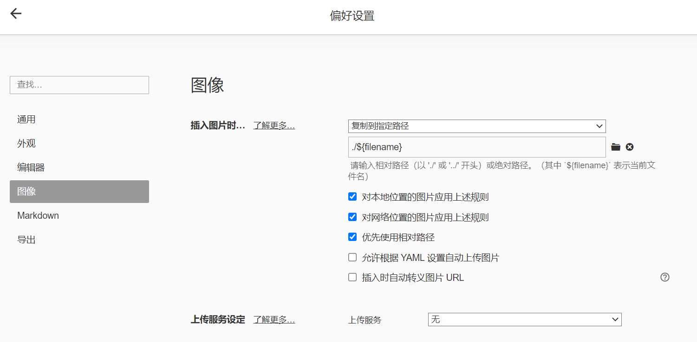

# HEXO 插入图片

在写笔记的时候插入图片上传到网站发现图片不能在网站上显示，第一时间想的是路径问题。

但是html的路径和主机中的路径又有差别，这其中是怎么联系起来的还不知道，于是上网找相关教程，发现两个比较好的教程（我已试验成功）如下：

[hexo博客中插入图片失败——解决思路及个人最终解决办法 **强烈推荐这个**](https://blog.csdn.net/m0_43401436/article/details/107191688)

[hexo博客显示markdown路径的图片](https://zhuanlan.zhihu.com/p/280758822)

总结为一下几步：

1. typora或者你自己mardown软件图像设置如下

   

2. 修改`_config.yml`中的`post_asset_folder: true`

3. 在终端中输入`npm install hexo-image-link --save`下载相关插件

4. 将写好的笔记和文件夹复制到`source/_posts`文件夹中即可，最后要注意在笔记的最上端写一些yml如下：

   ```yaml
   title: Hexo插入图片
   top: false
   cover: false
   toc: true
   mathjax: false
   date: 2024-05-04 21:13:32
   author:
   img:
   coverImg:
   password:
   summary:
   tags: HEXO
   categories: [HEXO图片插入指南]
   ```

5. 测试结果：


**大功告成！！！**
